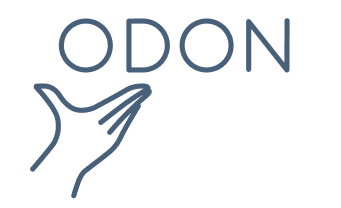

---
# Feel free to add content and custom Front Matter to this file.
# To modify the layout, see https://jekyllrb.com/docs/themes/#overriding-theme-defaults

layout: home
list_title: Neuigkeiten
---

Wir sind ein Verein, der sich auf die technische Verarbeitung und Nutzung von [Offenen Daten (Open Data)](/offene-daten) spezialisiert hat. Unser Ziel ist es, diese Daten **zugänglich** und **nutzbar** zu machen, um **Innovation**, **Transparenz** und **Wissen** in unserer Gemeinschaft zu fördern. 

## Was wir tun

- <b>Für Organisationen und Unternehmen</b>: Wir entwickeln [technische Lösungen](/technische-loesungen//) um Offene Daten für sie nutzbar zu machen und helfen bei allen Schritten von der Grundidee bis hin zur Veröffentlichung. 

<!--  -->

- <b>Für Mitglieder und die Data-Community</b>: Im [Verein](/verein/) vernetzen wir Datenenthusiasten, Entwickler, Forscher und Entscheidungsträger, um gemeinsam an Projekten zu arbeiten, die das volle Potenzial von Offenen Daten ausschöpfen. 

- <b>Für den Datenhunger</b>: Wir stellen APIs für verschiedene offene Daten zur Verfügung. Mehr dazu auf unsere [API Seite](/api/).

